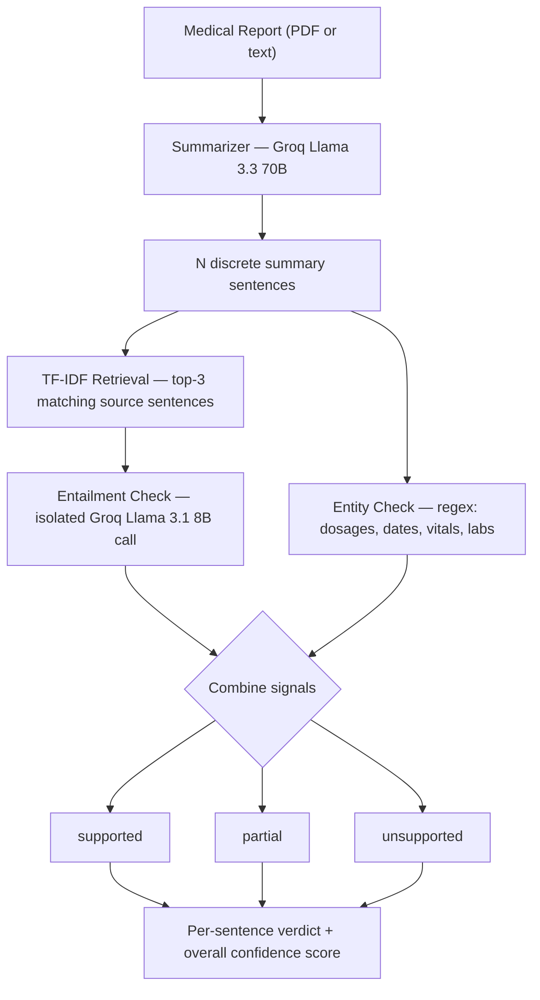

# Report Trace
### AI-Powered Medical Report Summarizer with Hallucination Detection

<p>
  
  
  
  
  
  
</p>

**Live app:** https://report-trace-17ah.vercel.app
**Backend API:** https://report-trace-upy2.vercel.app

Summarizes medical reports (pasted text or PDF) with an LLM, then verifies
every summary sentence against the source document before showing it to the
user, using a two-tier independent check rather than trusting the LLM's
output wholesale.

---

## Why hallucination detection matters here

LLM summarizers occasionally invent or distort details. In a medical report
that's not a cosmetic bug — a wrong dosage or lab value is dangerous. This
project treats the summary as a set of individually-checkable claims rather
than trusting the LLM's raw output.

## Architecture



**Why two tiers instead of just asking the LLM to self-check?** Asking a
model to grade its own output is circular — the same failure mode that
produced the hallucination can produce a false "looks fine." The entity
check is pure string matching with no model involved at all, and the
entailment check is a structurally separate call with no memory of the
summarization step. That independence is the point.

> **Note on the entailment model:** this originally used a dedicated NLI
> model (DeBERTa-v3) hosted on Hugging Face's free Inference API. That
> service was deprecated mid-project (the old `api-inference.huggingface.co`
> endpoint stopped resolving, and its replacement doesn't host small
> classification models reliably on the free tier) — so the entailment
> check was switched to a second, isolated Groq call instead. See
> [For the viva](#extending-this-for-the-viva) for how to talk about this
> tradeoff honestly.

## Screenshots

<table>
  <tr>
    <td align="center"><b>Pasted-text summary — 94% confidence</b></td>
    <td align="center"><b>PDF upload — 100% confidence</b></td>
  </tr>
  <tr>
    <td></td>
    <td></td>
  </tr>
</table>

*(Add your own screenshots to a `screenshots/` folder in the repo — the
discharge-summary test and the PDF-upload test both make good examples,
since they show partial/unsupported flags catching real edge cases.)*

## Project structure — two separate Vercel projects

```
report-trace/
  backend/
    main.py                    FastAPI app (Vercel entrypoint)
    app/
      summarizer.py             Groq API call, structured sentence output
      hallucination_detector.py TF-IDF retrieval + Groq verifier + entity check
      utils.py                  PDF extraction, regex sentence splitter, entity regex
      schemas.py                Pydantic request/response models
    requirements.txt
    vercel.json
    .env.example
  frontend/
    src/
      App.jsx                   Upload/paste UI + verified summary view
      index.css
    package.json
    vite.config.js
```

Backend and frontend deploy as **two independent Vercel projects** from
this one repo, each with its own "Root Directory" setting — `backend` and
`frontend` respectively. This avoids monorepo routing configuration
entirely and lets each half be redeployed or debugged independently.

## Deploying your own copy

### 1. Backend
- Vercel → **New Project** → import this repo → **Root Directory** = `backend`
- Environment variables:
  | Key | Value |
  |---|---|
  | `GROQ_API_KEY` | free at console.groq.com (no card required) |
  | `FRONTEND_ORIGIN` | your frontend's URL once deployed (step 2), for CORS |
  | `VERIFIER_MODEL` | optional, defaults to `llama-3.1-8b-instant` |
  | `SUMMARY_MODEL` | optional, defaults to `llama-3.3-70b-versatile` |
- **Deployment Protection** must be turned off (Settings → Deployment
  Protection → "Require Log In" → off), otherwise the frontend's requests
  get redirected to a login page instead of reaching the API.

### 2. Frontend
- Vercel → **New Project** → import the same repo → **Root Directory** = `frontend`
- Environment variable: `VITE_API_BASE` = your backend's URL from step 1
- Vite bakes env vars in at **build time** — if you change this after the
  first deploy, you must trigger a fresh deployment for it to take effect.

### Local development
```bash
# backend
cd backend
python -m venv venv && source venv/bin/activate
pip install -r requirements.txt
cp .env.example .env   # fill in GROQ_API_KEY
python main.py          # http://localhost:8000

# frontend (separate terminal)
cd frontend
npm install
npm run dev              # http://localhost:5173
```

## Extending this for the viva

Things worth being able to speak to:

- **Why TF-IDF for retrieval and not embeddings?** It's fast, needs no
  extra model download, and is fully explainable — you can show exactly
  why a sentence was picked as evidence. Swapping in embeddings is a
  natural "future work" point, trading transparency for better semantic
  matching.
- **Why a second LLM call instead of a dedicated NLI classifier?** The
  original design used a purpose-trained entailment model (DeBERTa-v3 on
  MNLI/FEVER/ANLI) via Hugging Face's hosted Inference API. That service
  was deprecated during development, so this was replaced with an
  isolated Groq call using a narrow, structured prompt. The honest
  tradeoff: a dedicated classifier is architecturally more independent
  (different training objective, not just a different prompt); an LLM
  call is more flexible but shares underlying model family with the
  summarizer, so the independence comes from prompt/context isolation
  rather than model diversity. Worth naming as a design compromise, not
  hiding it.
- **Why regex for entities and not a medical NER model** (e.g. scispaCy)?
  Regex is deterministic and auditable, which matters when you're the one
  defending false positives/negatives in a viva. A NER model would catch
  drug names and conditions the regex misses — a natural "future work"
  point.
- **Why regex sentence splitting instead of nltk?** nltk's tokenizer needs
  to download its punkt model on first use, which is a poor fit for a
  serverless cold start (no guaranteed writable cache, added latency). The
  regex splitter trades some accuracy on edge cases (unusual abbreviations)
  for zero runtime dependencies.
- **Failure modes worth naming:** the entailment call can be fooled by
  sentences that are topically similar but logically unsupported; the
  entity regex won't catch a hallucinated drug *name* (only malformed
  numbers/dates); TF-IDF retrieval can miss evidence if the summary
  paraphrases heavily; both LLM calls depend on Groq's uptime and rate
  limits.

## Notes

- Only PDF and pasted text are supported for input right now.
- The confidence score is `(supported + 0.5·partial) / total_claims` — a
  simple, explainable weighting, not a learned metric.
- Tested end-to-end with both pasted text and PDF upload (a synthetic lab
  report with vitals/labs tables), producing correctly traced, high-
  confidence summaries with appropriate partial/unsupported flags on
  genuinely ambiguous merges.
